

# PA4 Submission: TaskFlow Pipeline

## Student Information

| Field | Value |
|---|---|
| Name | Syed Safiullah |
| Roll Number | 26100268 |
| GitHub Repository URL | https://github.com/SyedSafiullahK/CS487-PA4 |
| Resource Group | `rg-sp26-26100268` |
| Assigned Region | `ukwest` |

---

## Task 1: App Service Web App (15 points)

### Evidence 1.1: Forked Repository

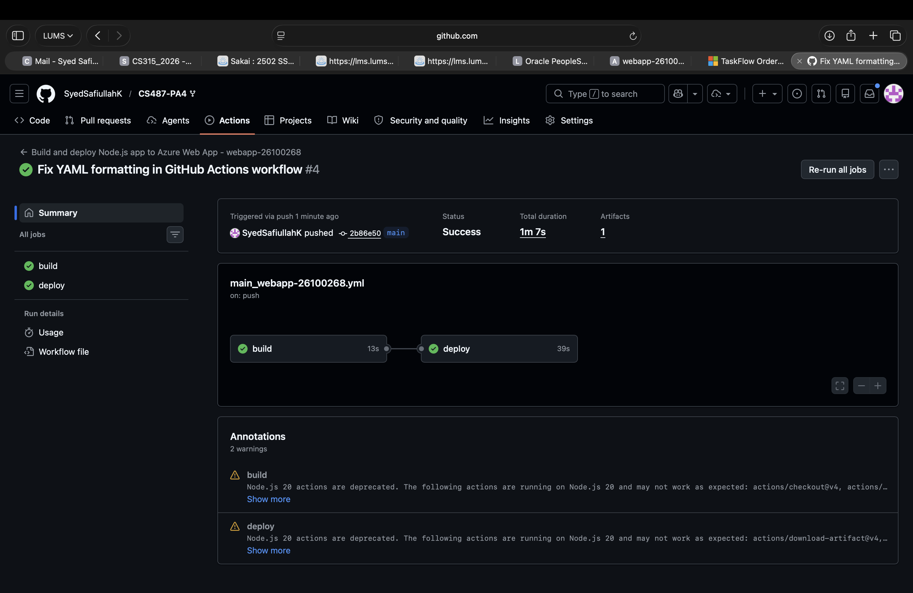

The screenshot shows a successful GitHub Actions deployment running on the `SyedSafiullahK/CS487-PA4` fork. This confirms the fork exists and the PA4 starter structure is in place with a working CI/CD pipeline connected to it.

### Evidence 1.2: App Service Overview

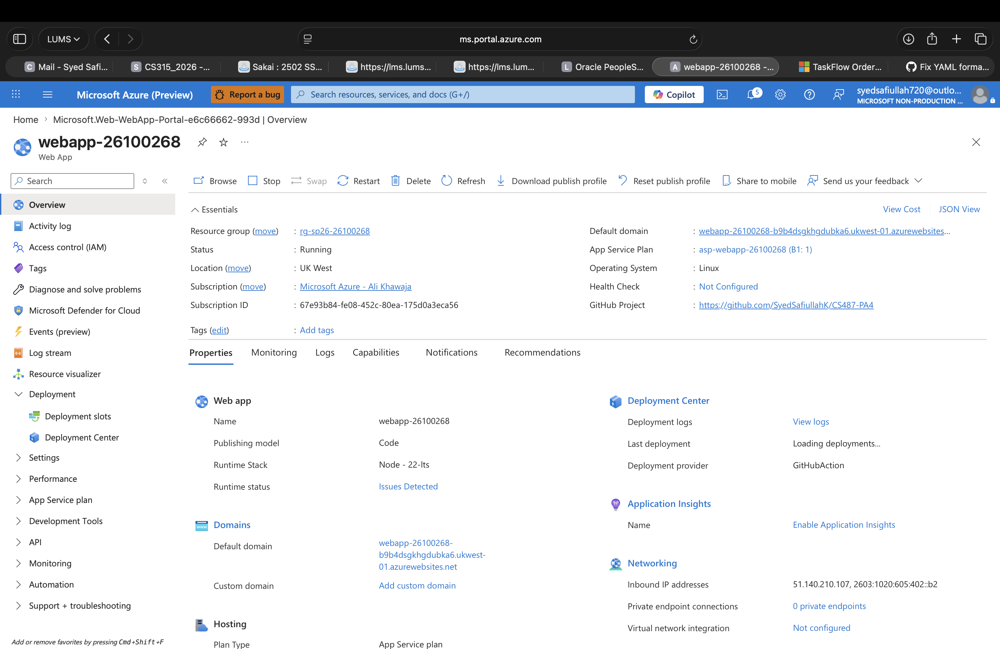

The Web App `webapp-26100268` is running in resource group `rg-sp26-26100268`, region UK West, with the Node.js 22 runtime on Linux. The public URL is `webapp-26100268.azurewebsites.net`.

### Evidence 1.3: Deployment Center / GitHub Actions

The Web App is connected to the `main` branch of the `SyedSafiullahK/CS487-PA4` GitHub repository via GitHub Actions. Azure committed a workflow file to the repo and every push to `main` triggers a build and deploy cycle automatically.

### Evidence 1.4: Live Web UI

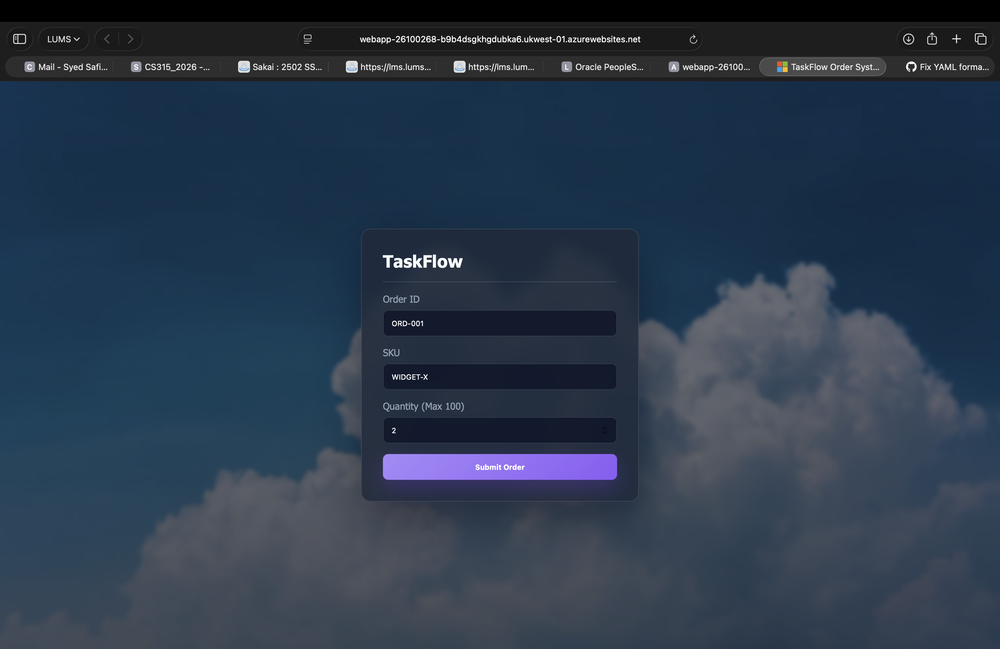

The TaskFlow frontend is being served successfully by the App Service. The order form loads in the browser, confirming the Node.js Express server is running and the static assets are deployed correctly.

---

## Task 2: Azure Container Registry (15 points)

### Evidence 2.1: ACR Overview

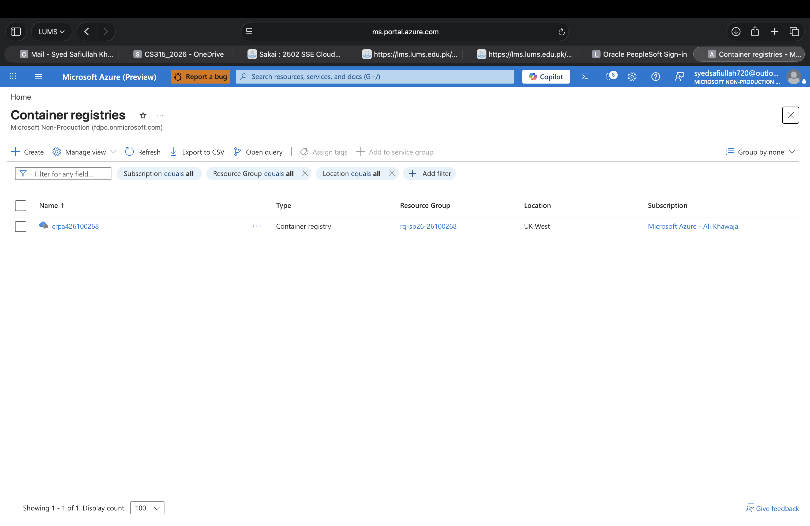

The container registry `crpa426100268` was created in resource group `rg-sp26-26100268` using the Basic SKU. Admin user is enabled for credential-based access from AKS and the Function App.

### Evidence 2.2: Docker Builds

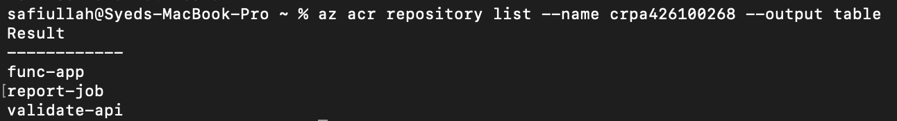

All three images were built locally using `docker buildx build --platform linux/amd64` (required for M1 Mac cross-compilation to AMD64) and pushed to the registry. The ACR repositories listing confirms all three images are present, which is direct proof of successful builds and pushes.

### Evidence 2.3: ACR Repositories

The registry contains all three required repositories: `validate-api:v1` (from `validate-api/`), `report-job:v1` (from `report-job/`), and `func-app:v1` (from `function-app/`).

---

## Task 3: Durable Function Implementation (12 points)

### Evidence 3.1: Completed Function Code

[function_app.py](function-app/function_app.py)

The orchestrator retrieves the input order and calls `validate_activity`, which POSTs to the AKS `VALIDATE_URL`. If the validator returns `valid: false`, the orchestrator immediately returns a rejected status with the reason. If valid, it calls `report_activity`, which uses the Azure Container Instance SDK to spin up the `report-job` container with the order details, waits for it to complete, cleans it up, and returns the blob URL of the generated PDF. The orchestrator then returns a completed status with that URL.

### Evidence 3.2: Local Function Handler Listing

The Durable Functions runtime registers four handlers from `function_app.py`: the HTTP starter (`http_starter`), the orchestration trigger (`my_orchestrator`), and the two activity triggers (`validate_activity` and `report_activity`). The smoke test in Evidence 4.2 confirms the runtime successfully discovered and loaded all handlers since the orchestration started and returned valid Durable status URLs.

---

## Task 4: Function App Container Deployment (8 points)

### Evidence 4.1: Function App Container Configuration

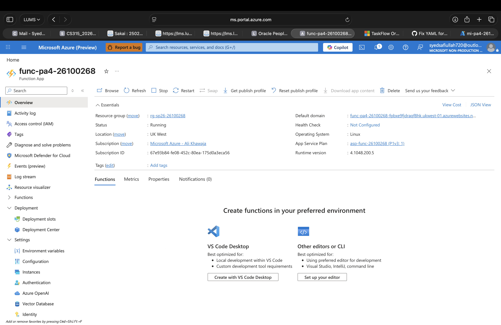

The Function App `func-pa4-26100268` is configured to run the `crpa426100268.azurecr.io/func-app:v1` container image. The App Service Plan is Linux-based and the deployment center shows the image pulled from ACR.

### Evidence 4.2: Orchestration Smoke Test

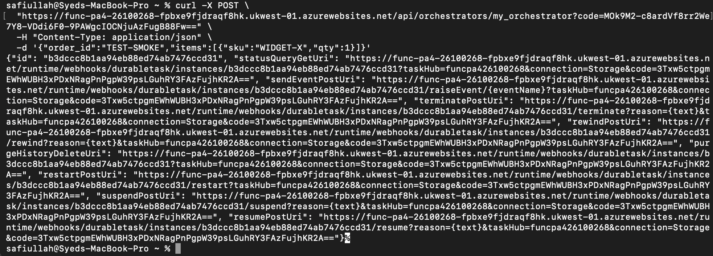

A POST to `/api/orchestrators/my_orchestrator` with a test order payload returned a JSON object containing an `id` and `statusQueryGetUri`. This proves the HTTP starter handler is reachable, the Durable Functions runtime is running inside the container, and a new orchestration instance was successfully created and queued.

### Evidence 4.3: Expected Failed Status Before Downstream Wiring

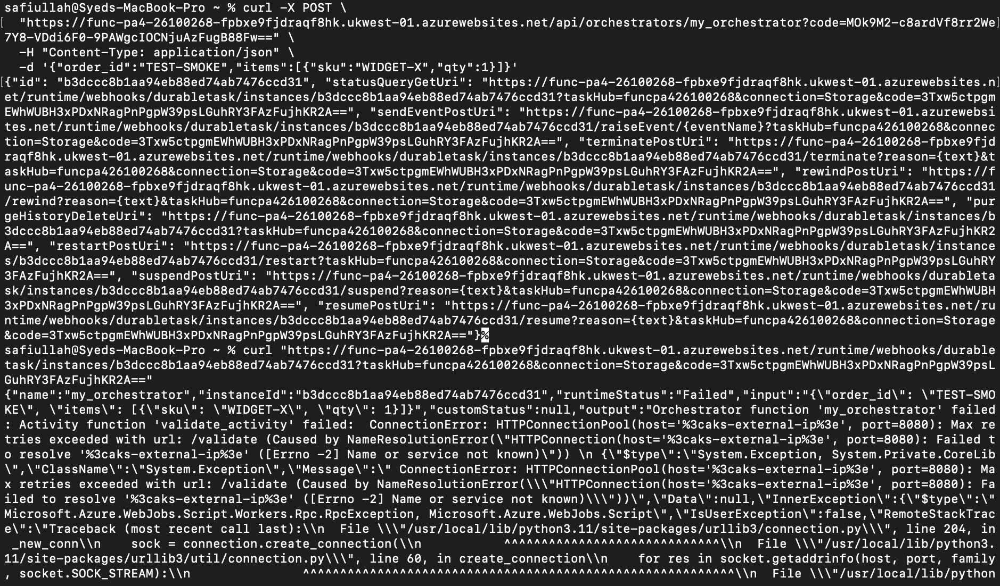

The status query at this stage returns a failed runtime status. This is expected because `VALIDATE_URL` was not yet configured — the `validate_activity` tried to read that environment variable and failed. This confirms the orchestrator correctly invoked the activity, which is the right behaviour before AKS was wired up.

---

## Task 5: AKS Validator (15 points)

### Evidence 5.1: AKS Cluster

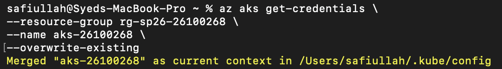

The AKS cluster `aks-26100268` is in resource group `rg-sp26-26100268` with a Succeeded provisioning state. It runs 2 nodes of size `Standard_D2s_v3` in the UK West region (B-series was unavailable in this region so D2s_v3 was used instead).

### Evidence 5.2: Kubernetes Nodes and Pods

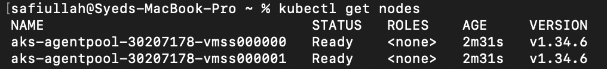

Both nodes are in Ready status. The `validate-api` pod was scheduled onto one of the nodes and is in Running state, confirming the deployment manifest was applied correctly and the image was pulled from ACR using the `acr-secret`.

### Evidence 5.3: Kubernetes Service

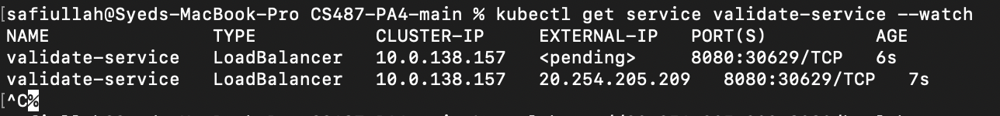

The `validate-service` LoadBalancer service exposes port 8080 externally. The external IP assigned by Azure is shown in the output. This IP was used as the `VALIDATE_URL` in the Function App settings.

### Evidence 5.4: Validator API Tests

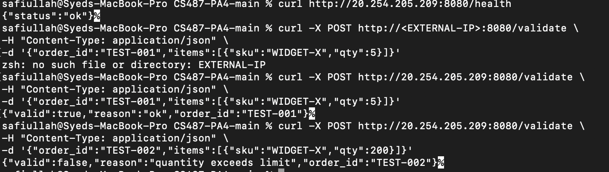

Three curl tests were run against the external IP: the `/health` endpoint returned `{"status":"ok"}`, a valid order with `qty: 5` returned `{"valid":true,"reason":"ok"}`, and an order with `qty: 200` returned `{"valid":false,"reason":"quantity exceeds limit"}`. This confirms the rejection rule (`qty > 100`) is working correctly.

### Evidence 5.5: Function App `VALIDATE_URL`

The `VALIDATE_URL` application setting in the Function App is set to `http://<AKS-EXTERNAL-IP>:8080/validate`, pointing to the AKS LoadBalancer service. This is how the `validate_activity` reaches the AKS validator during orchestration.

### Evidence 5.6: AKS Idle Behavior

After the end-to-end tests completed, the AKS nodes remain in Ready status with no change. Unlike ACI, AKS nodes continue running and billing even when there are no active orders. The node pool does not scale to zero on its own, which is the expected idle behaviour for a standard node pool without auto-scaling configured.

---

## Task 6: ACI Report Job (15 points)

### Evidence 6.1: Blob Container

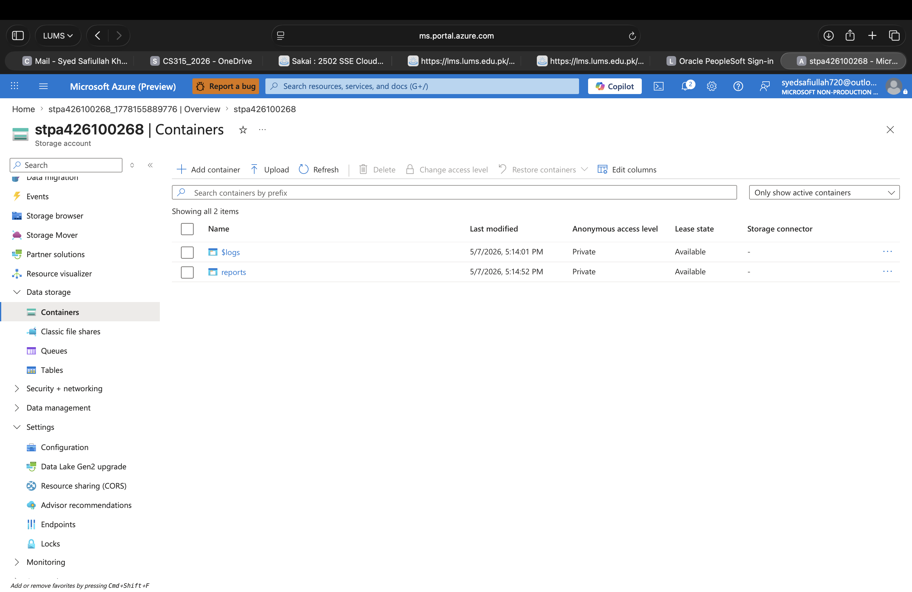

The `reports` blob container was created in storage account `stpa426100268`. This is where the `report-job` ACI container uploads generated PDFs. Access is private — the ACI authenticates using the user-assigned managed identity `mi-pa4-26100268`.

### Evidence 6.2: Manual ACI Run

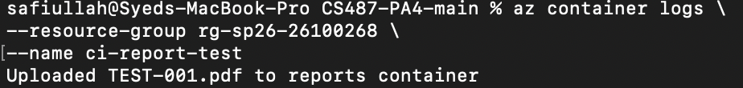

The manual test container `ci-report-test` was created via `az container create` with order ID `TEST-001`. The `az container show` output shows the container reached a `Succeeded` terminal state, confirming the one-shot job ran to completion and exited cleanly.

### Evidence 6.3: ACI Logs

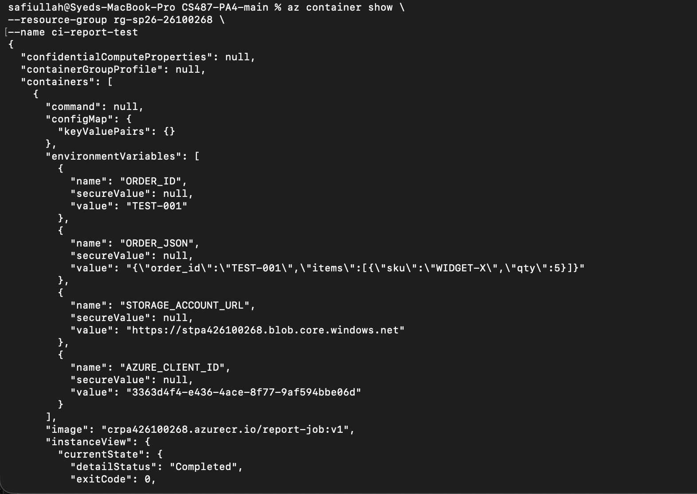

The container logs show `Uploaded TEST-001.pdf to reports container`, which is the print statement at the end of `generate.py` after a successful blob upload. This confirms the report job generated the PDF locally and uploaded it to blob storage using the managed identity credential.

### Evidence 6.4: Generated PDF

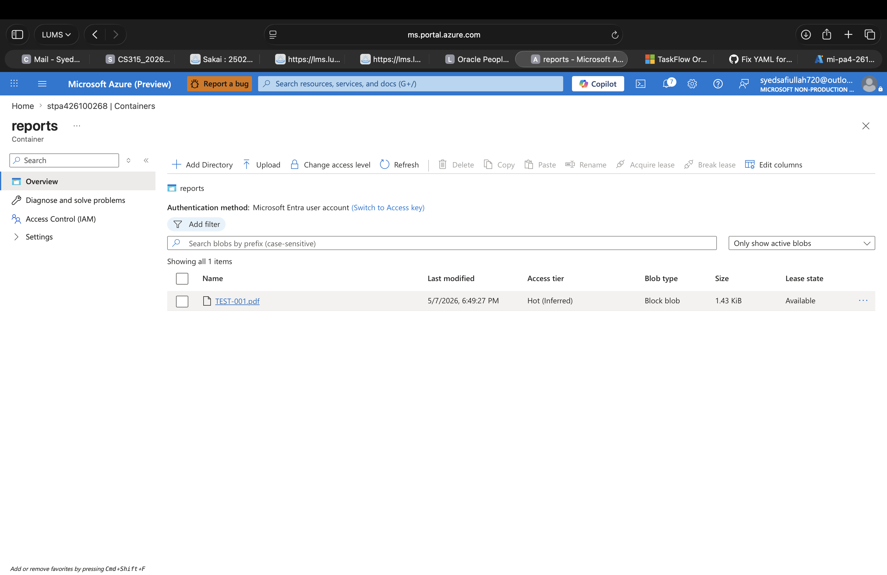

`TEST-001.pdf` is visible in the `reports` blob container in the Azure portal. This proves the ACI container successfully wrote to the storage account, which required the managed identity to have the `Storage Blob Data Contributor` role assigned on that account.

### Evidence 6.5: Function App Managed Identity and IAM

The Function App has the system-assigned managed identity enabled and a `Contributor` role assignment on resource group `rg-sp26-26100268`. This is required so the Function App can call the Azure Container Instance management API (`begin_create_or_update`) to spin up the `report-job` container during orchestration. Without this, the API call would return a 403.

### Evidence 6.6: Report App Settings

The Function App application settings include the following groups: `REPORT_*` settings (`REPORT_RG`, `REPORT_LOCATION`, `REPORT_IMAGE`) tell the orchestrator where and what to deploy for the ACI job. `ACR_*` settings (`ACR_SERVER`, `ACR_USERNAME`, `ACR_PASSWORD`) allow the ACI to pull the `report-job` image from the private registry. `STORAGE_ACCOUNT_URL` and `AZURE_CLIENT_ID` are passed as environment variables into the ACI container so it can authenticate with blob storage. `SUBSCRIPTION_ID` is used to instantiate the Container Instance management client. Secrets are masked.

---

## Task 7: End-to-End Pipeline (15 points)

### Evidence 7.1: Web App Wiring

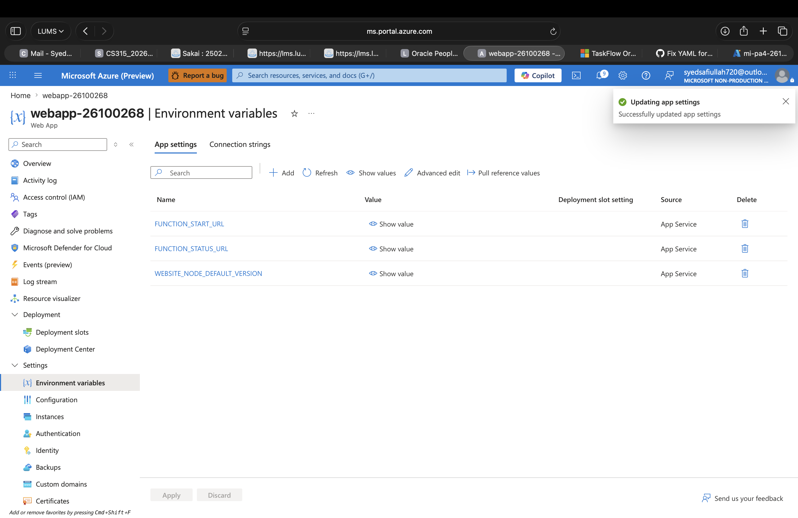

The Web App has `FUNCTION_START_URL` set to the full HTTP starter endpoint of the Function App (including the function key), and `FUNCTION_STATUS_URL` set to the Durable Task status base URL. The frontend POSTs to `/api/order` which proxies to `FUNCTION_START_URL`, and polls `/api/status` which validates the URL against `FUNCTION_STATUS_URL` before forwarding.

### Evidence 7.2: Happy Path UI

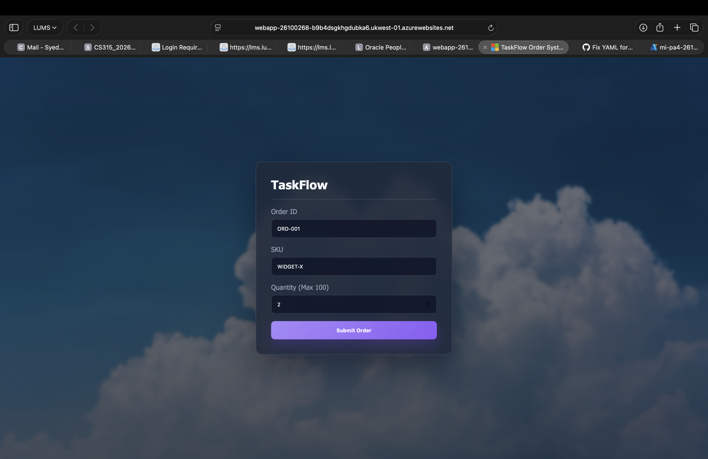

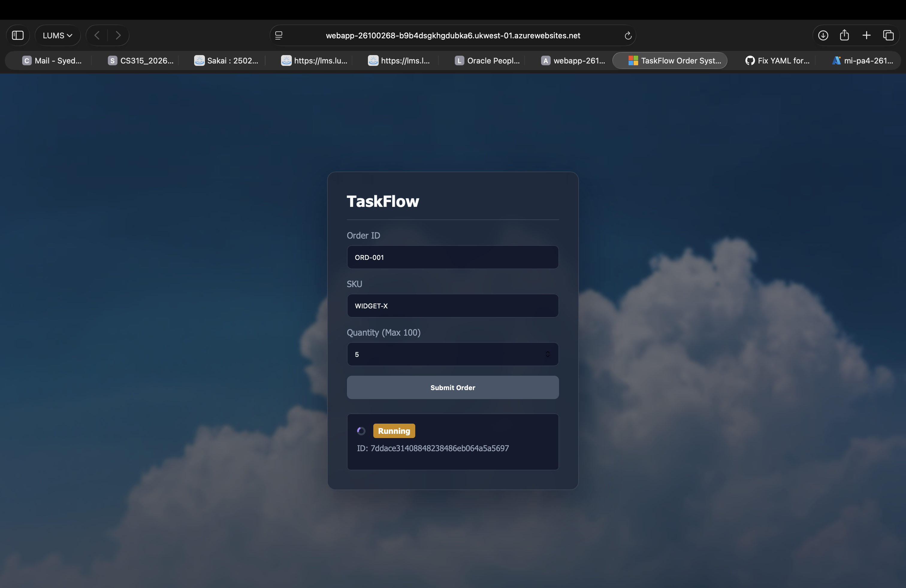

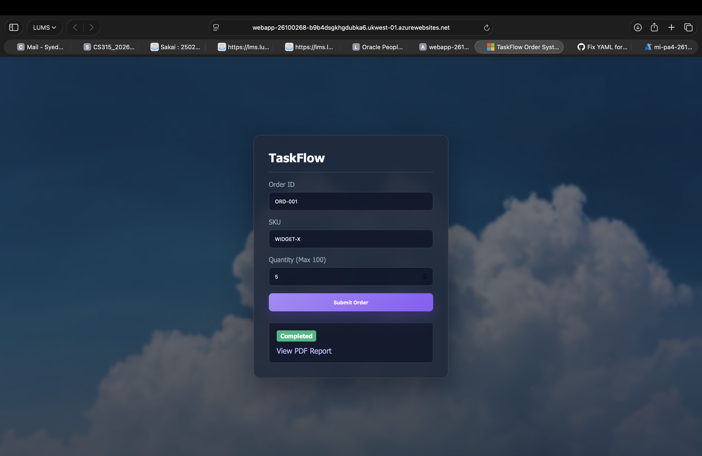

A valid order with `order_id: ORD-E2E-001`, `sku: WIDGET-X`, and `qty: 5` was submitted. The UI first showed a Running status with the orchestration instance ID, then after the pipeline completed, showed a Completed status with a link to the generated PDF report in blob storage.

### Evidence 7.3: Backend Participation

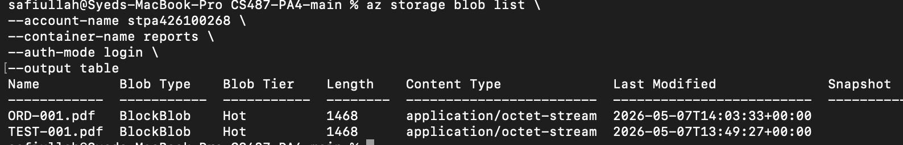

The blob storage listing confirms `ORD-E2E-001.pdf` was created, tracing the same order ID from the web form through the Durable orchestrator, through the AKS validator (which approved it), through the ACI report job, and into blob storage. All services participated in handling the same order.

### Evidence 7.4: Reject Path UI

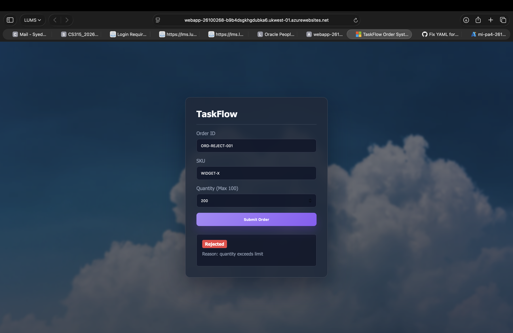

An order with `qty: 200` (greater than 100) was submitted. The AKS validator returned `valid: false` with reason `quantity exceeds limit`, and the orchestrator returned a rejected status without creating any ACI container. The UI correctly displayed the Rejected state with the reason from the validator.

---

## Task 8: Write-up and Architecture Diagram (5 points)

### Evidence 8.1: Architecture Diagram

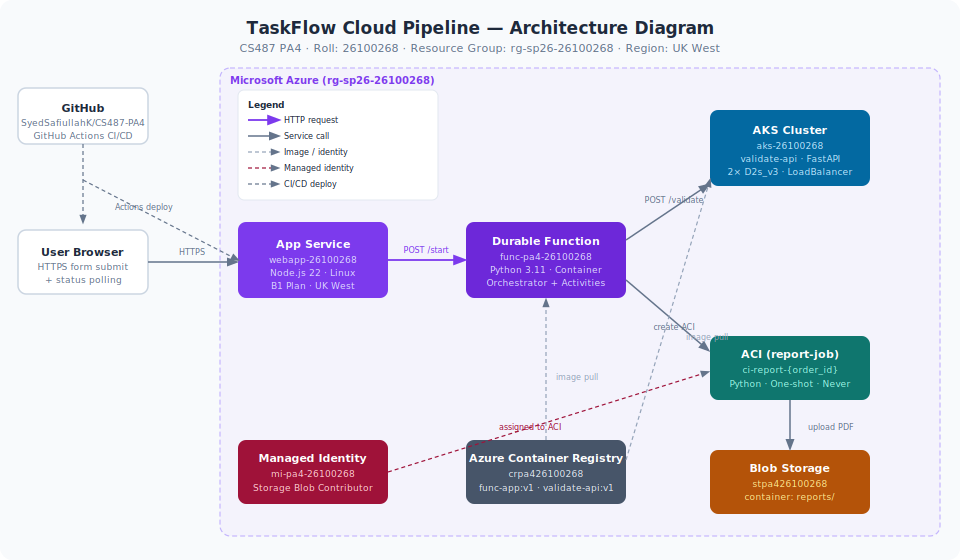

The diagram shows all components: GitHub (source + CI/CD), App Service (frontend), Durable Function (orchestrator + activities), AKS (validate-api), ACI (report-job), Blob Storage (PDF output), ACR (image registry), and the Managed Identity used by ACI to write to storage. Arrows show both the runtime request flow and the deployment/image-pull paths.

### Question 8.2: Service Selection

**App Service** is a good fit for the web frontend because it manages the Node.js runtime, handles HTTPS, and integrates directly with GitHub Actions for deployments without any container overhead. Since the frontend is just a lightweight Express proxy, there's no need to manage VMs or container orchestration for it.

**Durable Functions** are used because the pipeline has sequential async steps where each step depends on the result of the previous one. A plain HTTP trigger would time out waiting for the ACI to finish, or lose the workflow state entirely if the host restarted between validation and report generation. Durable Functions checkpoint state after each activity, so the orchestration survives restarts and can wait indefinitely for slow operations.

**AKS** is appropriate for the validator because it's a stateless REST service that needs to be always available and respond quickly to every order. Deploying it on Kubernetes gives a stable endpoint with its own compute that can be scaled independently, and the FastAPI app is simple enough that one pod handles the load for this use case.

**ACI** is the right choice for the report job because it's a one-shot batch task — generate a PDF and upload it, then exit. ACI spins up in seconds, runs the job, and is deleted immediately after. There's no reason to keep dedicated compute running for a job that only executes for about 30 seconds per order.

### Question 8.3: ACI vs AKS

**Idle behaviour:** AKS nodes run continuously regardless of order volume. As seen in the `kubectl get nodes` screenshot, the two D2s_v3 nodes stayed in Ready state even after all tests were done, with nothing running on them. ACI containers only exist while the report job is executing — they are created by the orchestrator, run for roughly 30 seconds, and then deleted. There is nothing idle to observe.

**Cost behaviour:** AKS bills per node per hour 24/7. ACI bills only for CPU and memory consumed while the container is running, making it extremely cheap for infrequent short jobs. For this assignment, the ACI cost for all test runs is negligible compared to the AKS node cost for a full day.

**Operational model:** AKS requires managing node pools, pod deployments, services, and image pull secrets. It gives you persistent compute with health checks and rollout control. ACI is fully managed and fire-and-forget — you hand it an image and environment variables and Azure handles everything else. AKS suits long-running services; ACI suits ephemeral batch workloads.

### Question 8.4: Durable Functions vs Plain HTTP

**State durability:** With a plain HTTP trigger, if the function host restarts after validation passes but before the ACI finishes, the entire workflow is lost and there's no way to recover. Durable Functions write checkpoints to storage after every activity completes, so if the host restarts mid-flow, the orchestration replays from the last checkpoint and continues correctly.

**Long-running operations:** The ACI report job can take minutes, and polling for its completion inside the `report_activity` loop adds more time. Plain Azure Function HTTP triggers have a response timeout, and while the underlying execution can extend via the `functionTimeout` setting, coordinating a multi-step async workflow reliably requires the Durable task framework. The Durable orchestrator can suspend and resume without holding threads, which is exactly what happens while waiting for the ACI to reach a terminal state.

### Question 8.5: Cost Review

A cost management screenshot was not captured during the assignment. The primary cost drivers are the AKS node pool (two `Standard_D2s_v3` nodes running continuously at approximately $0.096/hour each), followed by the Function App's App Service plan. The ACR, storage account, and ACI runs contribute negligible cost.

### Question 8.6: Challenges Faced

**M1 Mac architecture mismatch:** The first `docker build` attempts without specifying a platform produced ARM64 images. When these were deployed to Azure, the containers crashed immediately with an `exec format error` because Azure runs on AMD64 hardware. The fix was to use `docker buildx build --platform linux/amd64` for every image, which cross-compiles to the correct architecture.

**University network blocking Azure endpoints:** All `az` CLI commands failed with `Connection refused` when on the university network, including calls to `management.azure.com` and `crpa426100268.azurecr.io`. Even though `az login` had succeeded earlier by caching the OAuth token, actual API calls were blocked. The issue resolved immediately after switching to a home network, suggesting the university firewall was blocking outbound connections to Azure endpoints.
